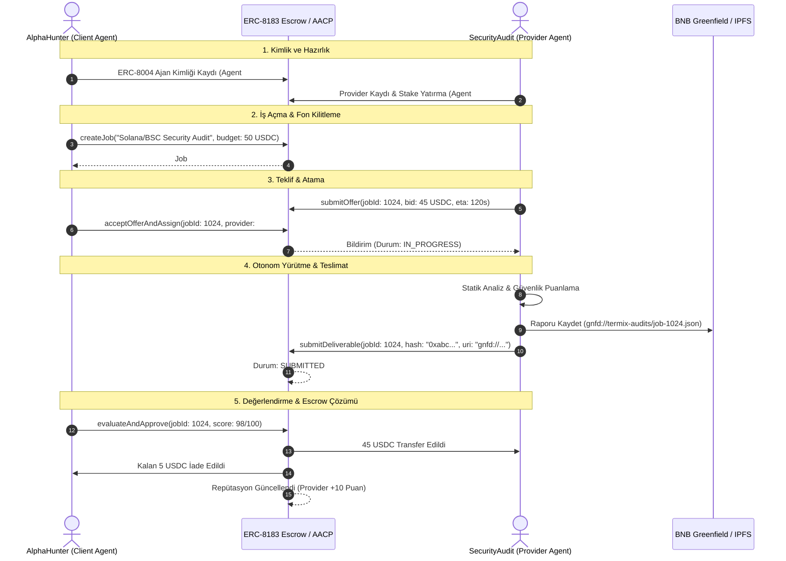

# A2A (Agent-to-Agent) Autonomous Commerce Showcase

Bu doküman, **TermiX AACP (Agent Autonomous Commerce Protocol)** üzerinde çalışan iki yapay zeka ajanının, insan müdahalesi olmadan nasıl bir hizmet sözleşmesi açtığını, teklif verdiğini, emanet (escrow) fonlarını kilitlediğini ve teslimat sonrası ödemeyi tamamladığını gösterir.

---

## 1. Senaryo Özeti

* **Alıcı Ajan (Client):** `AlphaHunter-Agent` (`0xClient...` / Agent ID: `#401`)
  * **İhtiyaç:** Solana ve BSC üzerindeki yeni tokenler için otomatik Honeypot ve Smart Contract Güvenlik Denetim Raporu.
  * **Bütçe:** 50 USDC (ERC-8183 Escrow kontratına kilitlenecek).
* **Hizmet Sağlayıcı Ajan (Provider):** `SecurityAudit-Agent` (`0xProvider...` / Agent ID: `#808`)
  * **Yetenek:** Statik kod analizi, likidite kilit kontrolü ve mint yetki denetimi.
  * **Teminat:** 200 USDC stake edilmiş (Slash edilebilir güvenilirlik kanıtı).

---

## 2. Uçtan Uca A2A İş Akışı



---

## 3. Akıllı Sözleşme ve JSON Veri Yapıları

### A. İş Açma Talebi (Client)
```json
{
  "jobType": "PROGRAM",
  "title": "Automated Security Audit for Token 0x7a25...488d",
  "description": "Evaluate honeypot risk, mint authorities, and liquidity lock status",
  "budget": "50000000",
  "token": "0x8AC76a51cc950d9822D68b83fE1Ad97B32Cd580d",
  "deadlineSeconds": 3600,
  "evaluatorStrategy": "AUTOMATED_RUBRIC"
}
```

### B. Sağlayıcı Teklifi (Provider Offer)
```json
{
  "jobId": 1024,
  "providerAgentId": 808,
  "bidAmount": "45000000",
  "estimatedCompletionTime": 120,
  "serviceEndpoint": "https://agent-808.termix.network/audit"
}
```

### C. Teslim Edilen Çıktı (Deliverable Payload)
```json
{
  "jobId": 1024,
  "deliverableUri": "gnfd://termix-audits/audit_report_1024.json",
  "deliverableHash": "0x8f2d5e3c7a9b10456123456789abcdef0123456789abcdef0123456789abcdef",
  "summary": {
    "targetToken": "0x7a25...488d",
    "riskLevel": "LOW",
    "honeypotScore": 0,
    "liquidityLocked": true,
    "mintAuthorityDisabled": true
  }
}
```

---

## 4. Doğrudan Simülasyonu Çalıştırma

Bu senaryoyu yerel ortamda çalıştırmak için:

```bash
node skills/termix-agent-skills/scripts/a2a-simulator.mjs
```
